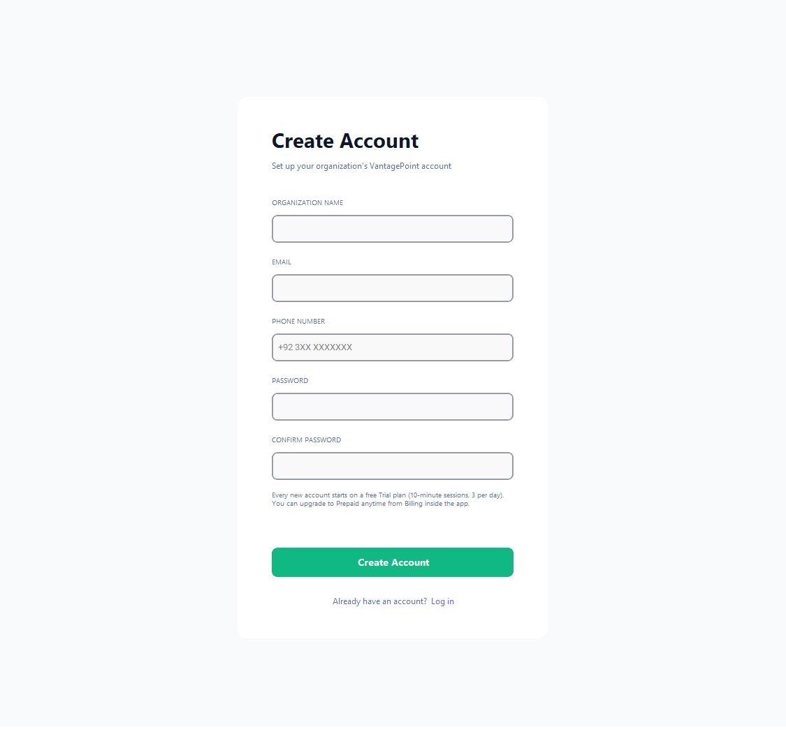
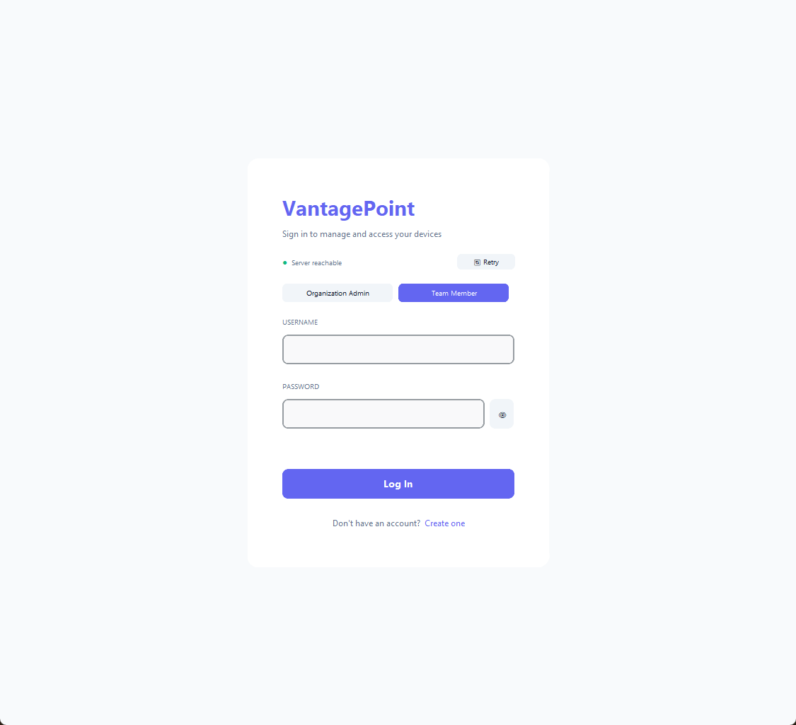
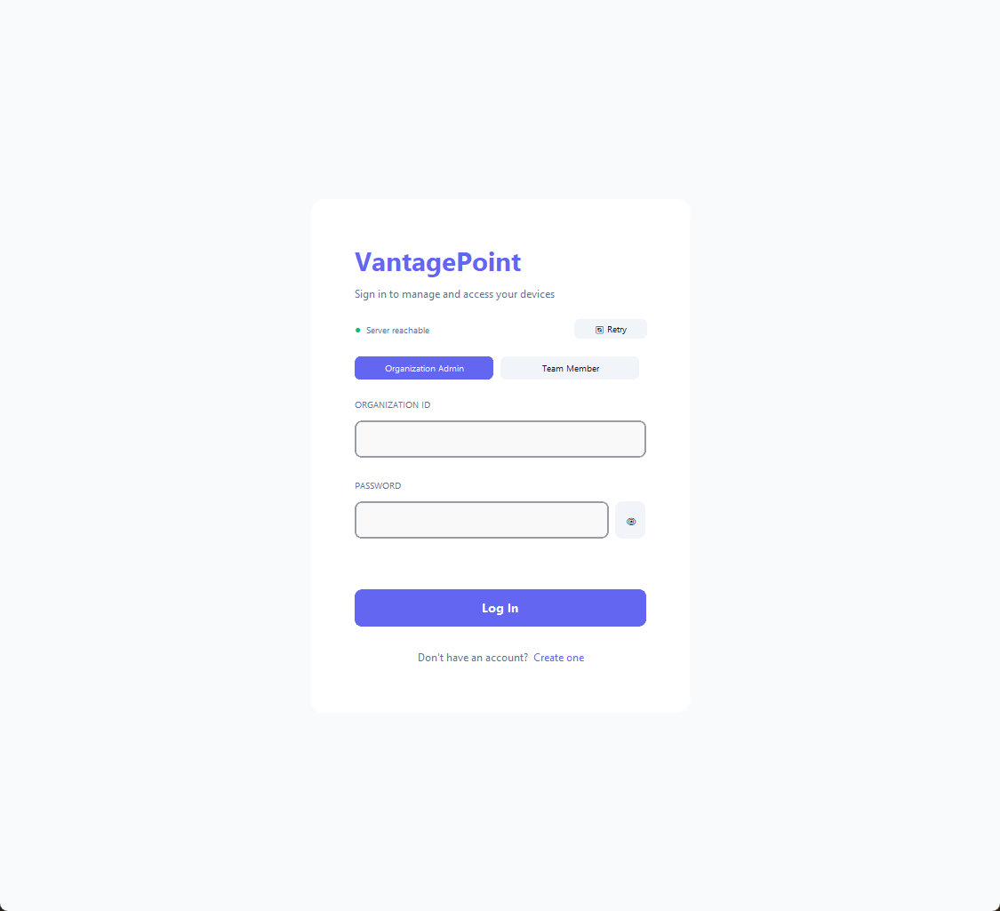
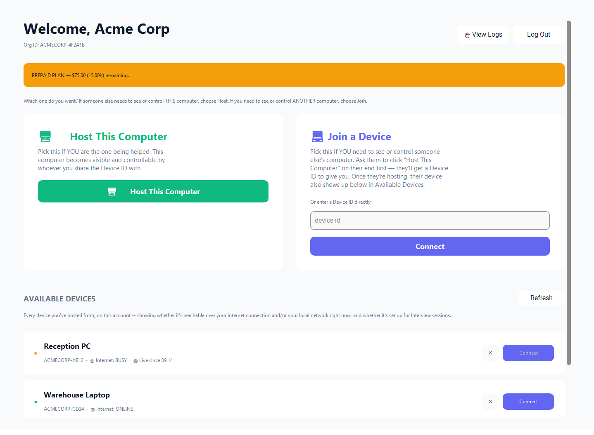
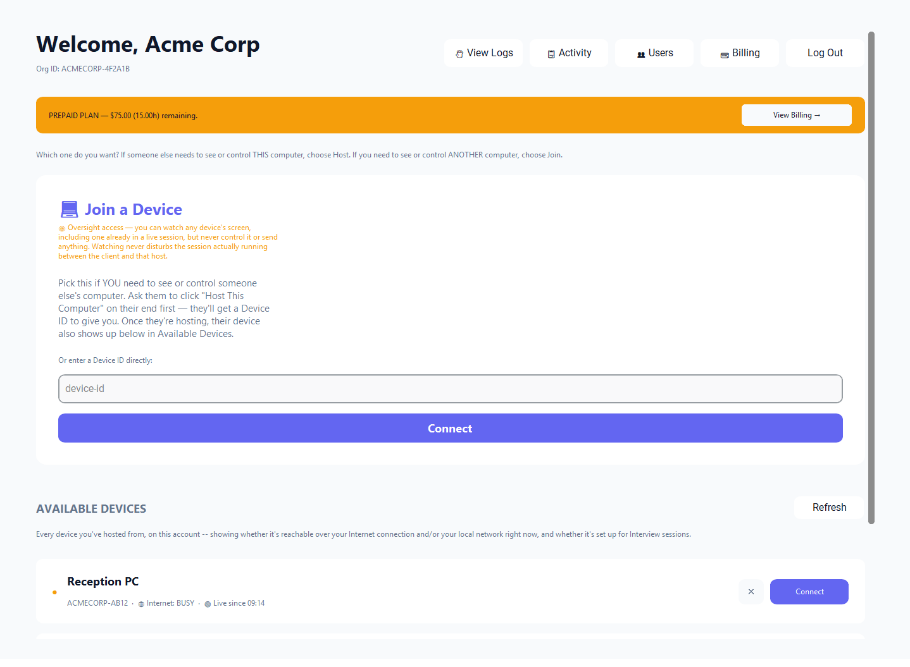
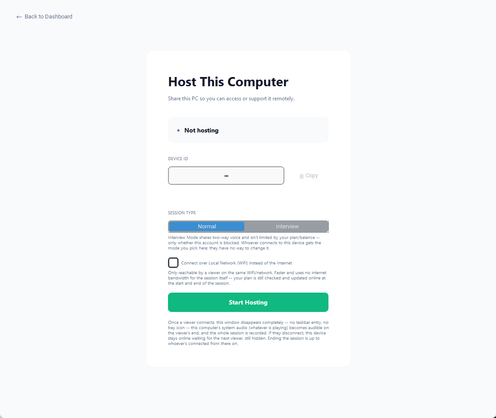
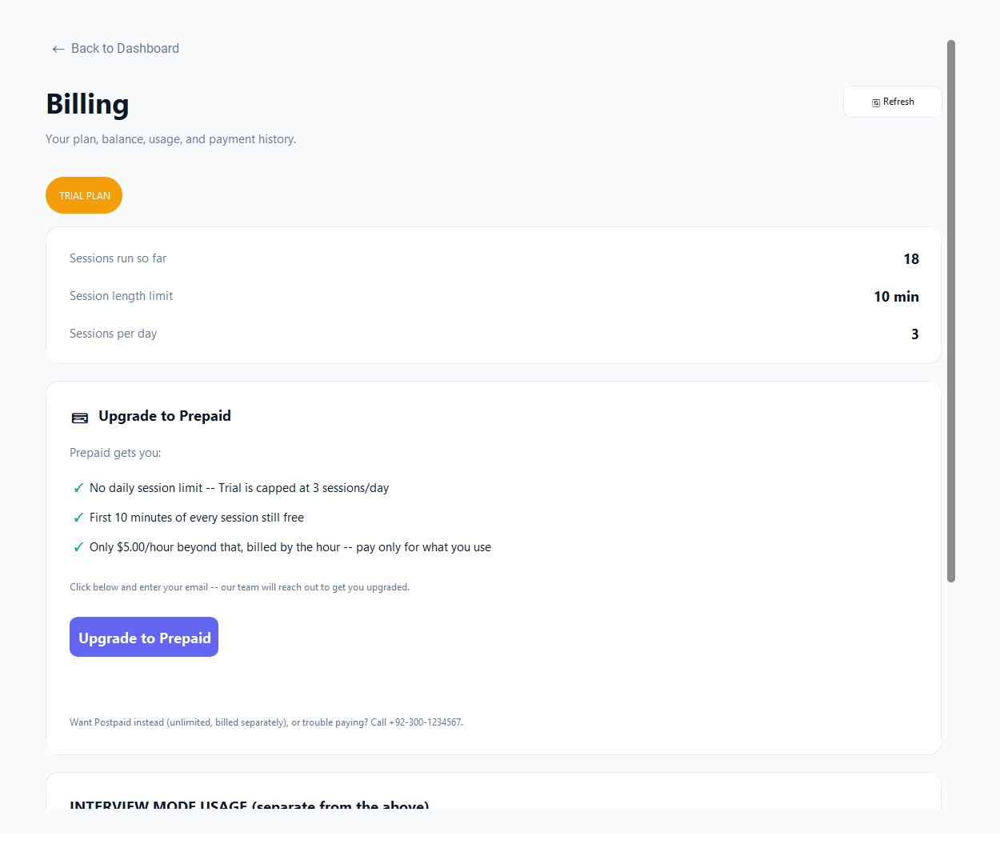
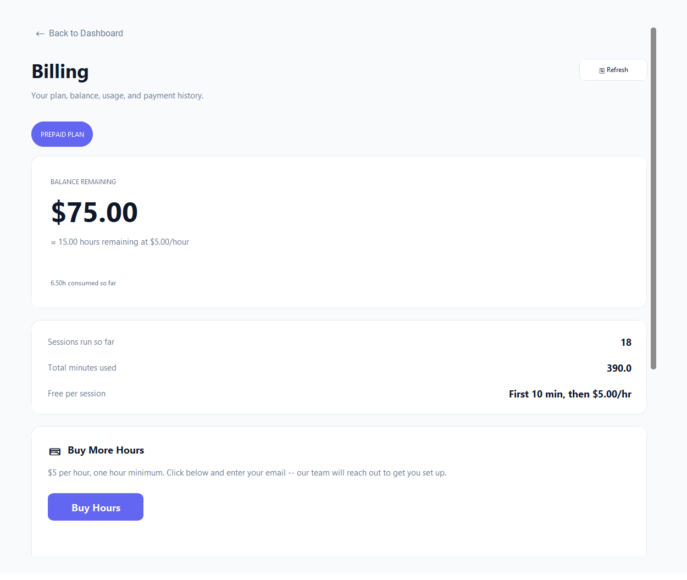
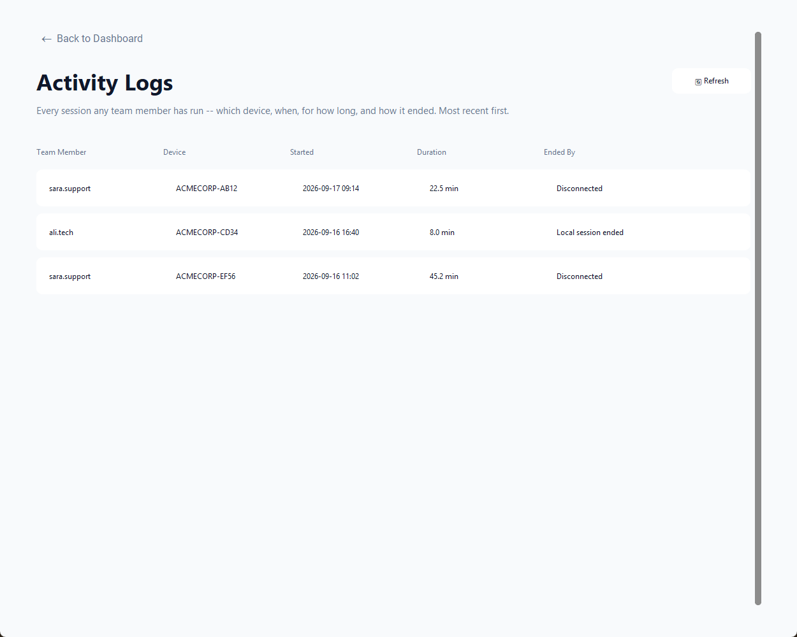
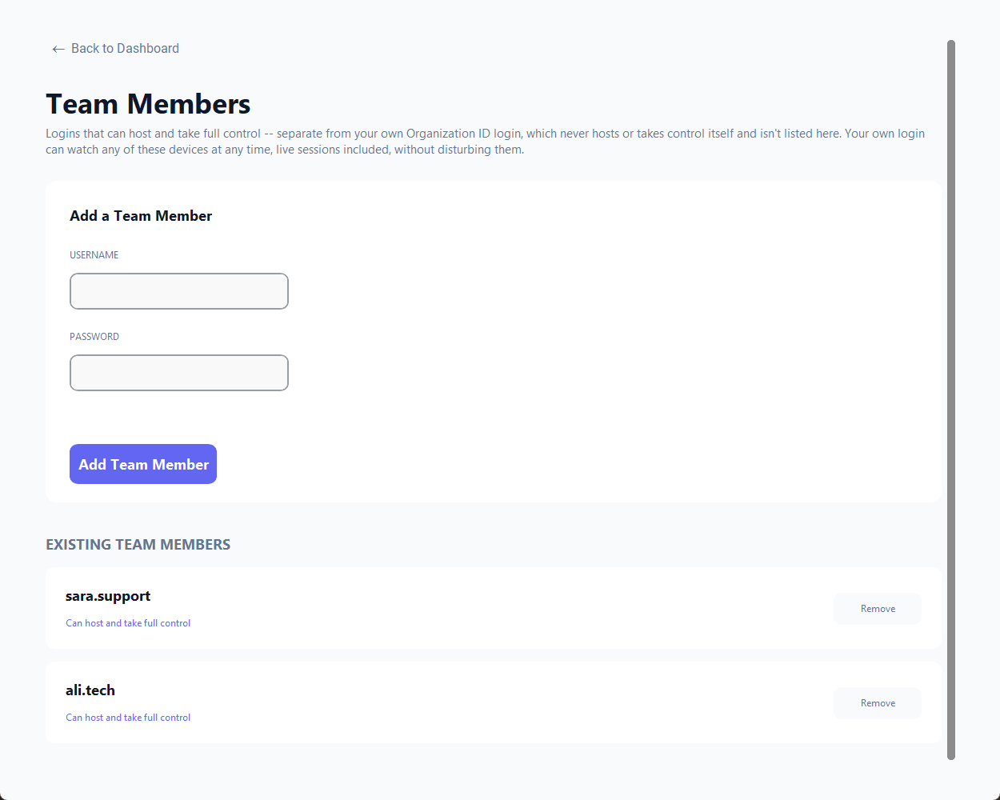

# VantagePoint User Guide

VantagePoint is a remote-support desktop app. One person **hosts** their computer to make it reachable, and another person **joins**/connects to it to view or control it, chat with them, and (in Interview Mode) talk with them live. This guide walks through installing the app and using every screen.

---

## 1. Installing VantagePoint

VantagePoint ships as a standard Windows installer, `VantagePoint-Setup.exe`.

1. Download the installer: **[VantagePoint-Setup.exe](https://storage.googleapis.com/retail-analysis-423205_cloudbuild/VantagePoint/VantagePoint-Setup.exe)**
2. Run the downloaded file and follow the setup wizard — choose an install location, and optionally create a desktop shortcut.
3. When installation finishes, launch **VantagePoint** from the Start Menu or the desktop shortcut.

Everything the app needs is installed together in its own folder — there's nothing else to configure before signing in.

---

## 2. Creating an Account

The first time you use VantagePoint, create an organization account from the login screen by clicking **Create one**.

- **Organization Name** — the name of your team or company.
- **Email** and **Phone Number** — used for account contact and support.
- **Password** / **Confirm Password** — your organization admin login.

Every new account starts on a free **Trial plan** (10-minute sessions, 3 per day). You can upgrade to a paid Prepaid plan at any time from Billing inside the app — see [Section 8](#8-billing).

---

## 3. Logging In

VantagePoint has two kinds of logins:

| Login type | Who uses it | Can it host or join devices? |
|---|---|---|
| **Team Member** | Support staff who actually host or join devices | Yes |
| **Organization Admin** | The account owner/manager | Never hosts or takes control itself — instead, it can **watch** any live session for oversight, and manage the account |

**Team Member** login:

**Organization Admin** login (switch tabs at the top, then sign in with your Organization ID instead of a username):

The green **Server reachable** indicator confirms the app can reach VantagePoint's servers before you try to log in. If it turns red, click **Retry**.

---

## 4. The Dashboard

After logging in you land on the Dashboard, which is where every session starts.

### Team Member view

- **Host This Computer** — pick this if *you* are the one being helped. Your computer becomes visible and controllable by whoever you share the Device ID with.
- **Join a Device** — pick this if *you* need to see or control someone else's computer. Enter their Device ID directly, or pick it from **Available Devices** below once they're hosting.
- The orange banner at the top always shows your current plan and remaining balance/hours.

### Organization Admin view

An admin login only ever sees **Join a Device**, and it's oversight-only: watching a device (even one already in a live session) never disturbs or takes over that session — you can look, but never control or send anything. Admins also get an extra navigation bar for:

- **View Logs** / **Activity** — see [Section 9](#9-activity-logs)
- **Users** — see [Section 10](#10-managing-team-members)
- **Billing** — see [Section 8](#8-billing)
- **Log Out**

---

## 5. Hosting a Device

Click **Host This Computer** from the Dashboard to open the Host screen.

- **Device ID** — a unique ID for this computer, generated automatically. Share it (via **Copy**) with whoever needs to join.
- **Session Type**:
  - **Normal** — a standard support session, counted against your plan's time/balance.
  - **Interview Mode** — a two-way voice call that isn't limited by your plan or balance (only whether the account is blocked). Whoever connects gets whatever mode you picked here; they can't change it.
- **Connect over Local Network (Wi-Fi) instead of the Internet** — check this if the viewer is on the same network. It's faster and uses no internet bandwidth for the session itself (your plan is still checked online at the start and end of the session).
- Click **Start Hosting** to go live.

Once a viewer connects, this window disappears completely — no taskbar entry, no tray icon. This computer's **system audio** (whatever is playing — a video, music, a call) becomes audible on the viewer's end for the rest of the session, and the whole session is recorded. If the viewer disconnects, the device stays online (still hidden) waiting for the next one. Ending the session is up to whoever is connected from that point on.

> **Note:** Only this computer's system audio is ever sent — your microphone is never captured or transmitted while hosting (except in Interview Mode, which is a deliberate two-way voice call both sides opt into).

---

## 6. Joining / Connecting to a Device

From the Dashboard's **Join a Device** panel:

- If the device is already listed under **Available Devices**, click its **Connect** button.
- Otherwise, type the Device ID directly into the **device-id** field and click **Connect**.

This opens the Viewer window for that device.

---

## 7. The Viewer Window

The Viewer window is where you actually watch or control a hosted device. Its control bar (top) includes:

- **🎤 Mute / 🔇 Muted** — always available. In Normal sessions, mutes the system audio you're hearing from the host. In Interview Mode, also stops sending your own mic.
- **🖱 Take Control / 👆 Release Control** — by default you're in Pointer Mode: moving your mouse only drives a visible marker overlay on the host's screen, and clicks just flash a "click here" pulse — nothing you do actually reaches the host's computer. Take Control opts into actually driving the host's mouse and keyboard.
- **Toggle Overlay (On/Off)** — shows or hides the movable text overlay on the host's screen.
- **📍 Position Text / 📌 Fix Position** — lets you drag the text overlay to where you want it on the host's screen, then lock it in place.
- **🔌 Disconnect** — ends the session at any time.
- **Terminate Connection** — appears if the connection drops and is reconnecting; use it to give up and close the session instead of waiting.

Below the control bar (when you're not just observing) is the **text bar**, for sending messages that appear as an overlay on the host's screen:

- Type a message and it's sent as you type.
- **🎙 Speak** — record a short voice note and have it transcribed to text automatically.
- **Clear** — clears the current overlay text.
- **⚙ Style** — customize the overlay's text color/size/font, the pointer's color/size, and how many words per line spoken transcripts wrap to.

If you're on a Trial plan, a dismissible banner across the top reminds you of your remaining session time.

---

## 8. Billing

Open **Billing** from the Dashboard (admin only) to see your plan, balance, usage, and payment history.

### Trial plan

Shows your session count so far, the 10-minute session length limit, and the 3-sessions-per-day cap. From here you can request an upgrade to Prepaid.

### Prepaid plan

Shows your current balance and hours remaining up top, total sessions/minutes used, and a **Buy Hours** button for topping up.

Clicking **Upgrade to Prepaid** / **Buy Hours** opens a page where you enter your email and submit a request — our team reaches out directly to get your account upgraded or topped up.

Use the **🔄 Refresh** button after completing a request to pull the latest balance.

---

## 9. Activity Logs

Available to Organization Admins only, via **View Logs** / **Activity** on the Dashboard.

Every session any team member has run, most recent first — which team member, which device, when it started, how long it lasted, and how it ended (e.g. disconnected by the viewer, or the local session ending on the host's side).

---

## 10. Managing Team Members

Available to Organization Admins only, via **Users** on the Dashboard.

- **Add a Team Member** — create a new login (username + password) that can host and take full control.
- **Existing Team Members** — see everyone with access, and **Remove** anyone who shouldn't have it anymore.

Your own Organization Admin login is intentionally separate from this list — it never hosts or takes control itself, but it can watch any of these team members' devices at any time, including live sessions, without disturbing them.

---

## Troubleshooting

- **"Server reachable" shows red on login** — check your internet connection, then click **Retry**. VantagePoint needs to reach its servers to log in, even for Local Network sessions.
- **Trial session ends unexpectedly** — Trial sessions are capped at 10 minutes each and 3 per day; upgrade to Prepaid (see [Section 8](#8-billing)) to remove both limits.
- **No sound from the host** — confirm the host actually has audio playing (system audio, not their mic) and that the viewer hasn't muted the session.
- **Account blocked** — hosting and joining (including Interview Mode) are disabled until this is lifted; contact your account admin or support.
